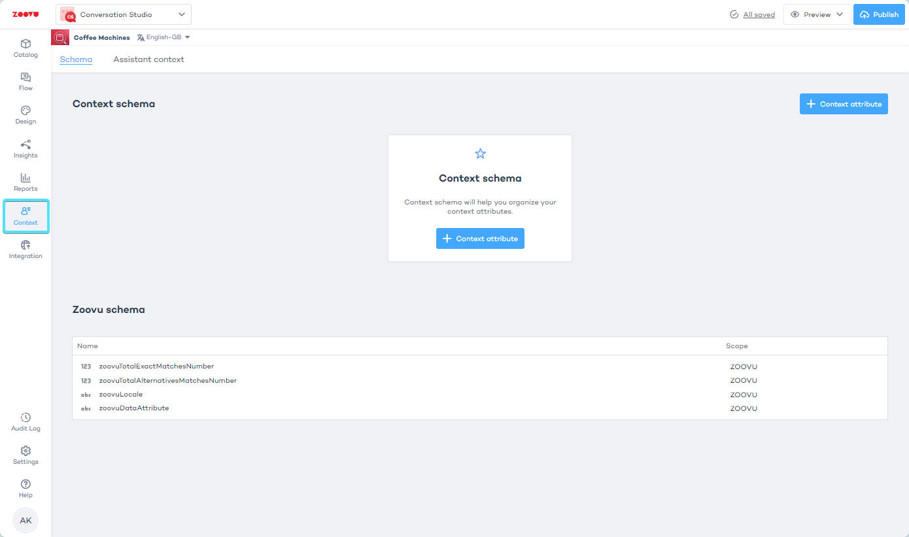
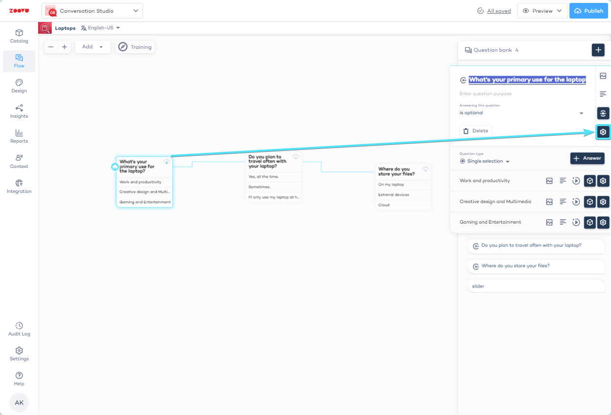
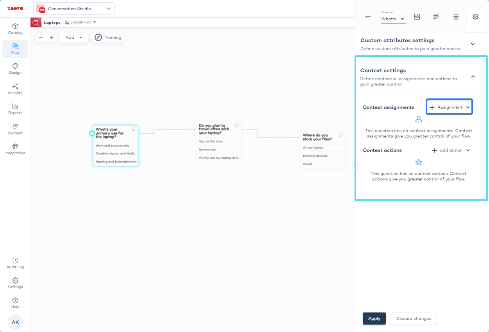
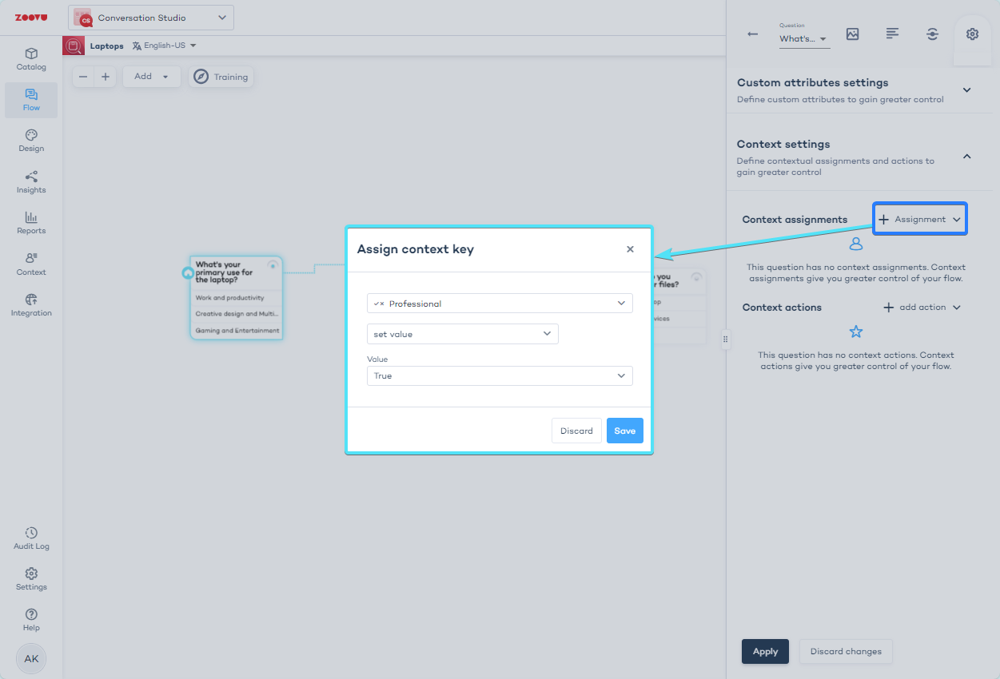
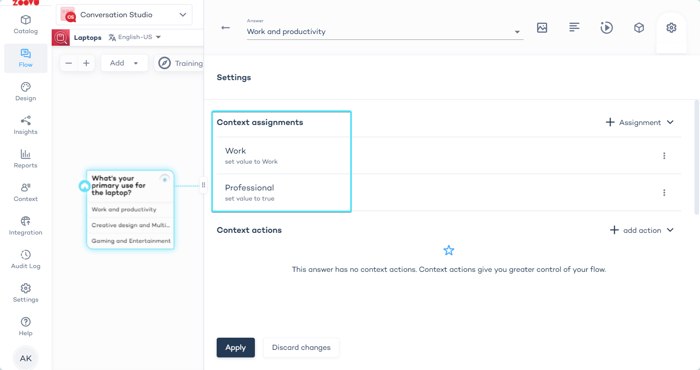

import BrowserWindow from "@site/src/components/BrowserWindow";

# Set up Context in a Digital Assistant

- Go to 'Context' in the left navbar of Conversation Studio.
- Click "+ Context attribute" and create attributes.

<BrowserWindow url="https://orca.zoovu.com/">

</BrowserWindow>

- Configure the attribute (see: [Configuration](./configuration.md)).
- For categories such as usage, choose a Text attribute and assign values like "daily" or "professional." For binary choices, use a Boolean attribute, such as isProfessional. 

:::info

Both `isProfessional=true` and `usage=professional` are valid.

:::

<BrowserWindow url="https://orca.zoovu.com/">

</BrowserWindow>

:::tip

While using text makes your schema more concise, Booleans can be less prone to errors as they allow you to see all potential values at once.

:::

- Go to the 'Flow' section in the left menu bar of Conversation Studio.
- Select a question and go to its settings OR select a specific answer to the question and select its settings.

<BrowserWindow url="https://orca.zoovu.com/">

</BrowserWindow>

- Find "Context assignments" and click "+ Assignment" to see the list of the Context Attributes you've created.

<BrowserWindow url="https://orca.zoovu.com/">

</BrowserWindow>

- **Assign context key**: use one of the available options to manage the way values are assigned to your attributes. For example, use "set value" to set the value of a Boolean attribute to "true" upon selection.

<BrowserWindow url="https://orca.zoovu.com/">

</BrowserWindow>

<BrowserWindow url="https://orca.zoovu.com/">

</BrowserWindow>

- Use "Context actions" to modify the Digital Assistant's flow depending on the customer's answers. 
- Make sure to click both 'Save' in the modal window and 'Apply' in the sidebar.