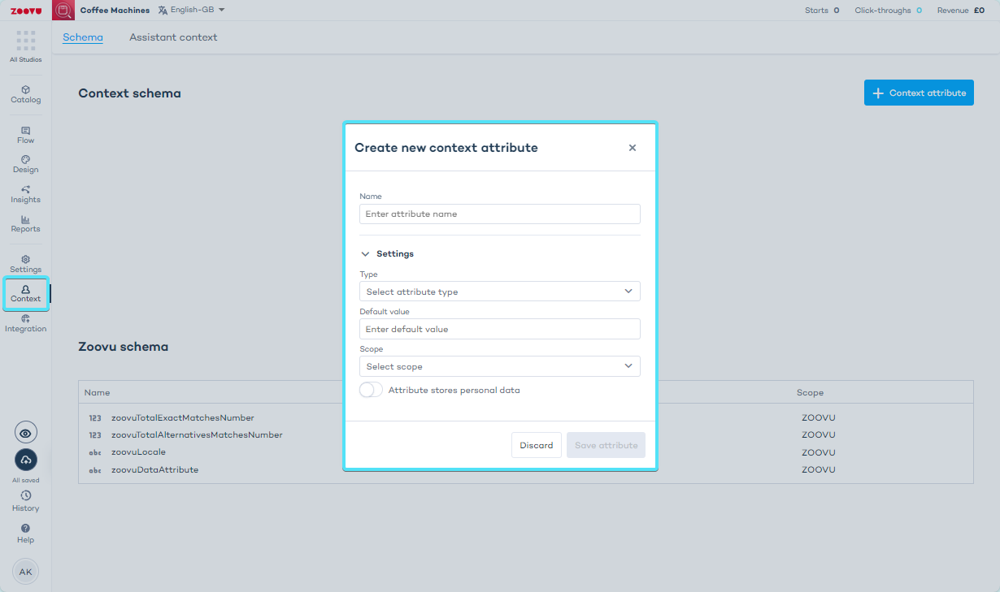

import BrowserWindow from "@site/src/components/BrowserWindow";

# Context Configuration
## Schema

The Schema is a formal description of the Context Attributes. This description contains:
- **Name**: used to identify the attribute.
- **Type**: specifies the attribute's data type; used to avoid logical errors such as assigning a text to a numerical attribute.
- **Default value**: depends on the attribute type, e.g. for a Boolean attribute the default value can be "True".
- **Scope**: defines where the attribute can be applied, such as Domain, Session, Provided, or Configuration, e.g. an attribute with the scope "Session" applies to a single interaction session between the user and the assistant. [Learn more.](./reference.md).
- an indication whether the attribute stores personal data (personal data is not sent to the server).

To access Context Schema, go to Conversation Studio > select an assistant > click **Context** on the left-hand menu.

<BrowserWindow url="https://orca.zoovu.com/">

</BrowserWindow>

### Zoovu schema

The *Zoovu schema* is a set of attributes managed by the assistant. It gives you access to data that is generated during the sessions (e.g. how many matching products have been found).

## Assistant level

At the assistant level, **attributes can be assigned initial values** upon starting or restarting an assistant. 

To manage this, go to Conversation Studio > Context > Assistant context.

The assistant level includes **actions** that can be executed initially. Using Domain or Provided scope, it's possible to customize user interaction from the outset.

For example, if a question like 'Which color do you like?' has been answered in a previous session, a subsequent assistant can skip this question if the answer is already known.

## Question level

### Context assignment

Context Assignments configured on Question level are executed when the Question loads. 

The assignment is executed in the order of the configuration.

:::info

Learn more about [Assignments](./reference.md).

:::

### Context Actions

Context Actions are executed on question load **after the context assignments**. 

Actions are executed when an optional condition is true. 

If no condition is provided, the action is always executed.

:::info

Learn more about [Actions](./reference.md).

:::

## Answer level

### Context assignment

Assignments at the Answer level activate when an answer is selected or deselected.

Each event has an operator, which differentiates between them. For instance, `set value` triggers upon selection and `set value on deselect` triggers upon deselection.

The assignment is executed in the order of the configuration.

### Context Actions

Context Actions are either configured when the question loads or when the answer is selected.
