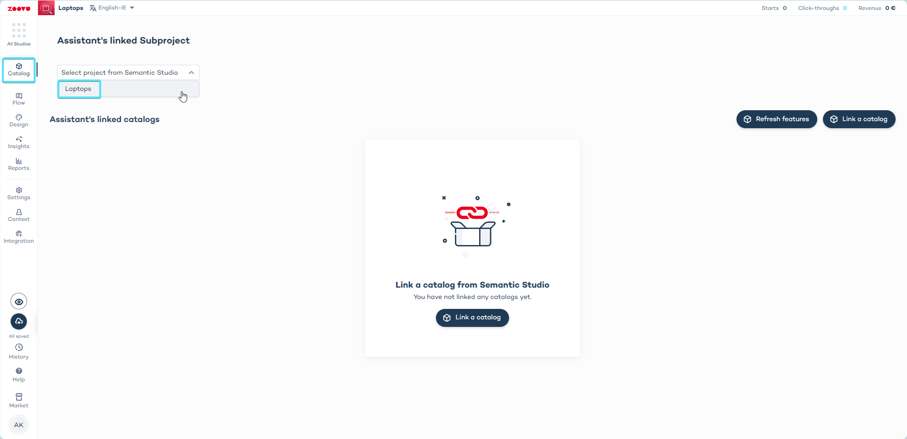

import BrowserWindow from "@site/src/components/BrowserWindow";

# Setup and prerequisites

To set up Zoe for integration with your platform, choose one of the following methods based on your needs:

**1. Digital Assistant Integration**

With this integration, Zoe operates within a question and answer flow created in your Digital Assistant. This setup allows Zoe to collect contextual information about customers, which is then used to tailor product descriptions.

If you want to integrate Zoe with your Digital Assistant, you will need:

- Data Project
- A Digital Assistant in Conversation Studio
- Context

**2. PDP Integration**

Integrate Zoe on your Product Detail Page to answer product-related questions. For this method, a Digital Assistant is not required so all you need is a **Data Project**.

## Data Project

Before creating a Zoe project, make sure that your product data is integrated within the Zoovu Data Platform. Zoe uses your cleaned and enriched data stored in the Zoovu Data Platform to be able to generate personalized product descriptions and accurate answers to product related questions. 

Go to Data Platform > Projects to see the list of your Data Projects.

:::note

If you need help with setting up a Data Project, reach out to your Zoovu contact - we have the solution.

:::

## A Digital Assistant in Conversation Studio

A Zoe Advisor can be integrated within multiple existing Digital Assistants to add personalized statements of why a product is a good fit for a customer.

For this, make sure that the Digital Assistant is linked to the corresponding Data Project:

Go to **Conversation Studio > Catalog** and link the assistant to your Data Project, selecting it from the dropdown menu.

<BrowserWindow url="https://orca.zoovu.com">
    
</BrowserWindow>

If you are creating a new Digital Assistant for your Zoe project:

Enable the "Semantic Studio data source" by switching on the toggle. (This will ensure that you can link the assistant to a Data Project.)

## Context

A Zoe Advisor can use contextual information of the customer’s preferences and needs to personalize product descriptions and conversations about products.

Read how you can configure and set up Context in a Digital Assistant:

Step 1: [Configure Context](../../advanced/context/configuration.md)
Step 2: [Set up Context in a Digital Assistant](../../advanced/context/assistant_setup.md)