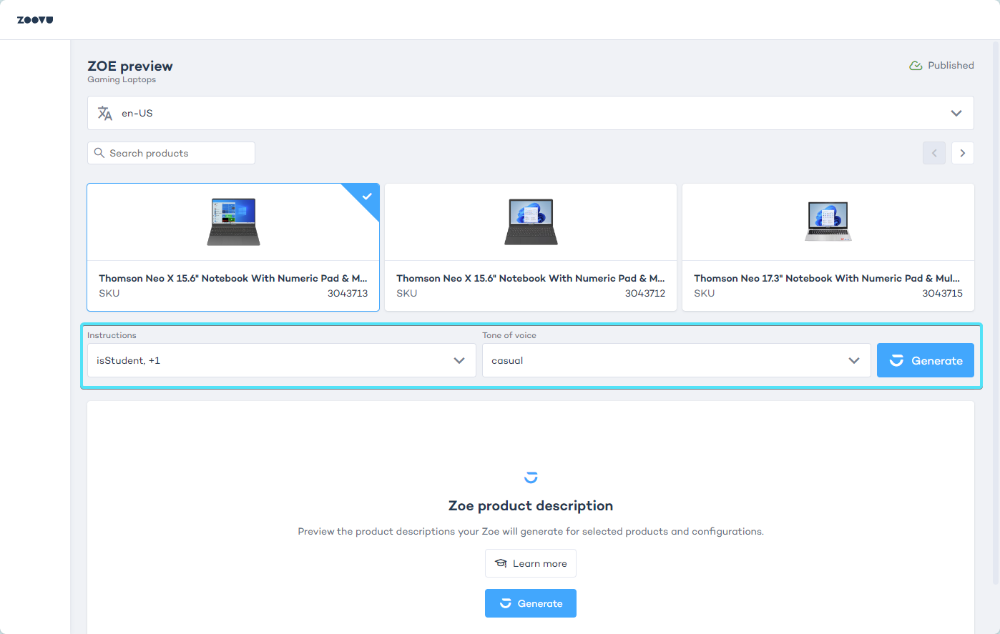

import BrowserWindow from "@site/src/components/BrowserWindow";

# Test and preview your Zoe Advisor

The preview enables you to test Zoe's outputs and identify if refinements will be necessary.

To start generating previews you need:
- a product catalog linked to Zoe
- at least one 'Instruction'
- at least one 'Tone of voice'

**Step 1**: Select any product from the preview (or use the search box to find a particular product).

**Step 2**: Select which Instructions and "Tone of voice" should be used in the description preview. Expand the dropdown menus and check any combination.

**Step 3**: Click "Generate" on the right-hand side of the panel.

## Zoe preview

To see the latest version of your Zoe Advisor in action, make sure to click "Publish" in the top right corner of the configuration panel.
- Click "Preview".
- Once inside the Preview, select a product. 
- Choose any combination of Instructions and Tone of voice.
- Click "Generate".

You can interact and ask questions to test how your Zoe responds.

To generate a different product description, select a different product and/or change the parameters under Instructions and Tone of voice, then click "Generate".

:::note

Zoe may generate descriptions for combinations that are not representative of real usage, unlike a Digital Assistant which will recommend a product based on the needs that are selected.

:::

## Generate product descriptions in multiple languages

Zoe supports multiple languages.
- Go to Advisor Studio > Zoe > Products and edit the products settings.
- Select multiple locales from the dropdown menu (each locale consists of a language and a country).
- Click "Save".

As soon as you save the Products settings, you will be able to select the added languages in the Preview:

Zoe should be able to find the SKUs recommended by the assistant in the Data Project that has been configured for this locale. The locale used by the assistant must be available in the Zoe configuration. Otherwise, Zoe will not respond.

:::tip

When digital assistants use different data projects for the same locale, you may have to set up different Zoe configurations for best results.

:::