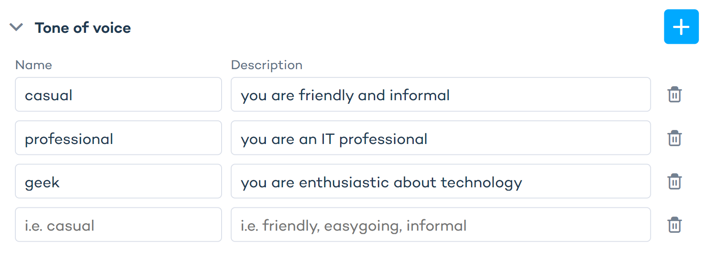

import BrowserWindow from "@site/src/components/BrowserWindow";

# Create and configure a Zoe Advisor

## Create a Zoe Advisor

- Go to **Advisor Studio > Zoe Advisors**. 
- Click the "+ Create advisor" button to create a new Zoe project.

<BrowserWindow url="https://orca-advisor.zoovu.com">
    
</BrowserWindow>

- Assign a unique name to your Zoe and connect it to a Data Project. 
- For integration within a Digital Assistant, make sure to select the correct Data Project and locale.

<BrowserWindow url="https://orca-advisor.zoovu.com">
    
</BrowserWindow>

:::info

Zoe Advisor projects are locale-specific. This means that you can only connect each Zoe Advisor with a unique locale. 

:::

## Configure Zoe 

To edit or configure Zoe, go to Advisor Studio > Zoe Advisors and click the pencil icon next to your Zoe Advisor:

<BrowserWindow url="https://orca-advisor.zoovu.com">
    
</BrowserWindow>

In the setup panel, you are able to define the configuration settings and preview the results:

<BrowserWindow url="https://orca-advisor.zoovu.com">
    
</BrowserWindow>

### Configure "Products"

The "Products" tab displays the Data Project that is connected to your Zoe. By clicking the "+" icon next to the tile or the pencil icon, you can:
- select a different catalog from the same Data Project, or
- change the locale.

To remove the product catalog from your Zoe project, click the three dots icon and select "Delete".

:::note

To connect an existing Zoe with a different catalog or different locale, create a new Zoe project.

:::

### Configure "Instructions"

The Instructions section is where you can provide information about the customer context to help Zoe personalize product detail descriptions.

This can include:
- browser history
- search history
- categories visited
- products clicked
- Digital Assistant

Through the use of matching keys, you can specify and describe multiple customer contexts that Zoe can consider.

<BrowserWindow url="https://orca-advisor.zoovu.com">
    
</BrowserWindow>

:::note
Learn more about [**Context**](../../../advanced/context/assistant_setup.md).
:::

#### Name

Name is used to identify a particular context characteristic or buyer persona.  

Set up each attribute to reflect customer insights. 
- Choose a **String attribute** for detailed behaviors like `usageFrequency` or `expertise`, assigning values such as "daily" or "professional."
- For simple yes/no decisions, use a **Boolean attribute** like `isProfessional` and set it to true or false.

#### Description

Description provides a textual explanation of the instruction.

| Context attribute | Type    | Value   | Name              | Description                                                        |
|-------------------|---------|---------|-------------------|--------------------------------------------------------------------|
| usage             | String  | extreme | usage:extreme     | "the product will be used in extreme conditions"                   |
| travelsOften      | Boolean | True    | travelsOften      | "the product will be used while travelling from place to place"    |
| travelsOften      | Boolean | False   | travelsOften:false| "the product won't often be used while travelling"                 |
| character         | string  | batman  | character:batman  | "the user likes batman-themed products"                            |

The following guidelines are recommended for writing Descriptions: 
- The product should have ... 
- The product will be used for ... 
- The product needs to have ... 
- The laptop ... 
- The mattress ... 
- The product needs to be ... 

Avoid phrases like: 
- The customer needs ... 
- The customer requires ...

### Configure "Tone of voice"

Tone of voice defines the style of the generated product description. It instructs Zoe’s LLMs on how to articulate its responses.

<BrowserWindow url="https://orca-advisor.zoovu.com">
    
</BrowserWindow>

Tone of Voice requires two distinct values: 

- **Name**: the relevant context attribute and its value. 
- **Description**: the specific tone you want to adopt.

| Name          | Description                                                         | Expected result                                                                                           |
|---------------|---------------------------------------------------------------------|-----------------------------------------------------------------------------------------------------------|
| isDeveloper   | You are a software developer highlighting this product's features to another developer. | The product description uses technical jargon and highlights the performance.                             |
| travelsOften  | You are a traveler who likes freedom and adventure.                 | The description highlights the equipment's endurance and portability. It also references travel and adventure. |
| funny         | funny and light                                                     | The description is light-hearted, uses slang, and focuses on trendy features.                             |

:::note

Both 'Tone of voice' and 'Instructions' are activated in the same way - by a **context variable**. In other words, the same variable could activate an instruction and tone of voice. 

:::

### Configure "Support topics"

In this section, you can specify how Zoe Advisors should respond to non-product related questions.

For example, if a customer asks about return policies, you can configure Zoe to provide a link to the page on your website where they can find this information. 

This is especially useful for frequently asked questions about: 
- Return policy
- Shipping and delivery options
- Payment methods
- Opening hours
- General support

<BrowserWindow url="https://orca-advisor.zoovu.com">
    
</BrowserWindow>

:::warning

Make sure to enter a valid URL in each text field.

:::

### Configure "Fallback topics"

This setting allows you to control conversations with Zoe that do not refer to the currently viewed product.

Zoe will not provide answers to non-product related questions (such as "Do you like cookies?”) and will not engage in inappropriate conversations.

Your customers may want to ask about similar product (e.g. cheaper laptops) or a completely different product or service. Here you can define where your customers should be redirected to.

Examples: 
- Comparisons, suggestions or other product questions from same category: `https://mywebsite/shop/laptops`
- Unrelated queries: `https://mywebsite/shop`

<BrowserWindow url="https://orca-advisor.zoovu.com">
    
</BrowserWindow>

### Configure "Company information"

Here, you can provide Zoe with information about your company, such as your boilerplate or company description and purpose, to help Zoe generate responses as a representative of your company.

<BrowserWindow url="https://orca-advisor.zoovu.com">
    
</BrowserWindow>

For example, you can name your main competitors to prevent Zoe from directing users to their shops.

## Edit or export a Zoe Advisor

The following options are available for every Zoe Advisor:
- “Publish” (the cloud icon)
- “Edit” (the pencil icon)
- More options (the three dots icon):
    - Edit name
    - Open preview
    - Duplicate
    - Export configuration
    - Delete

:::note

Use the “Export configuration” option if you want to **save your Zoe configuration** (Instructions, Tone of voice, etc.) as a JSON file. These configuration files can be imported into Advisor Studio using the “Import” button in the top right corner.

:::

Next steps: [style your Zoe Advisor](./experience_designer.md) and [link it to a Digital Assistant](../zoe_integration/digital_assistant.md) or [embed it directly on your page](../zoe_integration/website_widget.md).