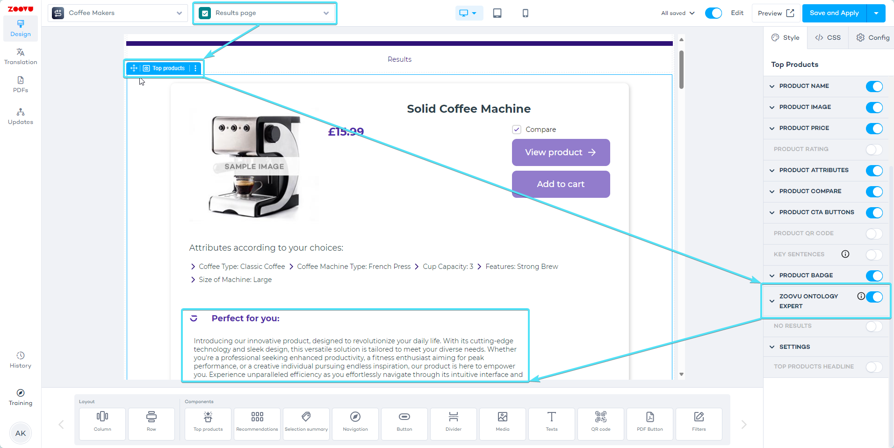

import BrowserWindow from "@site/src/components/BrowserWindow";

# Enable Zoe chat

You can enable the chat [in Experience Designer while styling you Zoe](./experience_designer.md).

When enabled, Zoe chat will be able to answer your customers' product-related questions in real time.

- Select the Top Product component on your canvas.
- View "Top Product" settings in the right-hand menu.
- Navigate to the "Zoovu Ontology Expert" settings.

<BrowserWindow url="https://orca-advisor.zoovu.com">
    
</BrowserWindow>

- Switch on the "Use chat" toggle.

<BrowserWindow url="https://orca-advisor.zoovu.com">
    
</BrowserWindow>