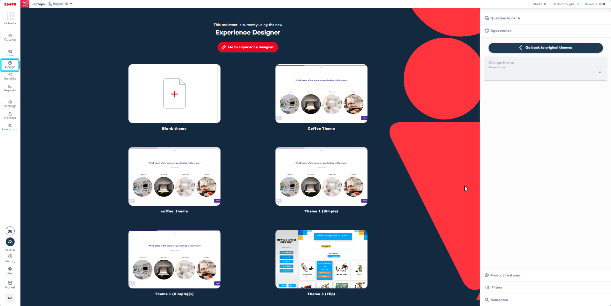

import BrowserWindow from "@site/src/components/BrowserWindow";

# Style your Zoe Advisor in Experience Designer

You can style and preview your Zoe after embedding it into the Results Page of your assistant using Experience Designer.

- In **Conversation Studio**, go to the Design tab in the left menu. 
- Assign a theme and then click the “Go to Experience Designer” button on the top of the page.

<BrowserWindow url="https://orca.zoovu.com">
    
</BrowserWindow>

- In **Experience Designer**, select the ‘Results page’ from the page selector above your canvas.

- Select the ‘Top Products’ component on the canvas to see its settings in the right-hand menu.

- Enable the ‘Zoovu Ontology Expert’ toggle in the Top Products Settings. (If you can’t see this toggle, please contact the Support.)

<BrowserWindow url="https://orca-experience.zoovu.com">
    
</BrowserWindow>

- Add custom styles.

Right on the top of the settings, you will see two toggles:
- Use chat (enables the user to ask questions about the product and receive answers from Zoe).
- Typing animation (ads an animation to the chat box, simulating a person typing a message as the user waits for their answer - this is a nice touch, making the experience feel more natural).

In the same menu, you can style the background, margin and padding. You can also add a border and shadow to the element.

<BrowserWindow url="https://orca-experience.zoovu.com">
    
</BrowserWindow>

Scroll down to see additional settings for the Zoe component:
- Heading (compose the text displayed in the Personalized Heading component)
- Description (style the product description box, from font to colors)
- User Chat Bubble (see: [Enable Zoe chat](./enable_zoe_chat.md))
- Zoe Chat Bubble
- Feedback (allow your user to see the “Was this helpful” prompt and select Yes/No)
- Chat Input (style the input box, in which the user types their questions)
- Send Question Button
- Legal Content Message (optional, recommended)
- Terms and Conditions (optional, recommended)

Finally, click "Save and apply" to publish the changes. 

Your Customers will now see the personalized description under the top recommended product.