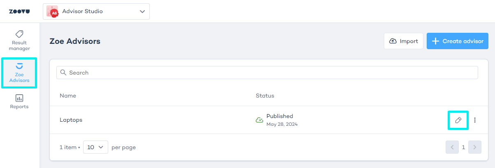

import BrowserWindow from "@site/src/components/BrowserWindow";

# Integrate Zoe with a Digital Assistant

The "Integration" tab in **Advisor Studio > Zoe Advisors** becomes available after you create a Zoe Advisor.

- Go to Advisor Studio > Zoe Advisors.
- Select and edit a Zoe Advisor:

- Navigate to **Advisor Studio > Zoe Advisors > Integration**.
- Select "Assistant component".
- Click the "Link an assistant" button.
- Select the Digital Assistant to which you want to link Zoe.

:::info

You can link Zoe to several Digital Assistants.

:::