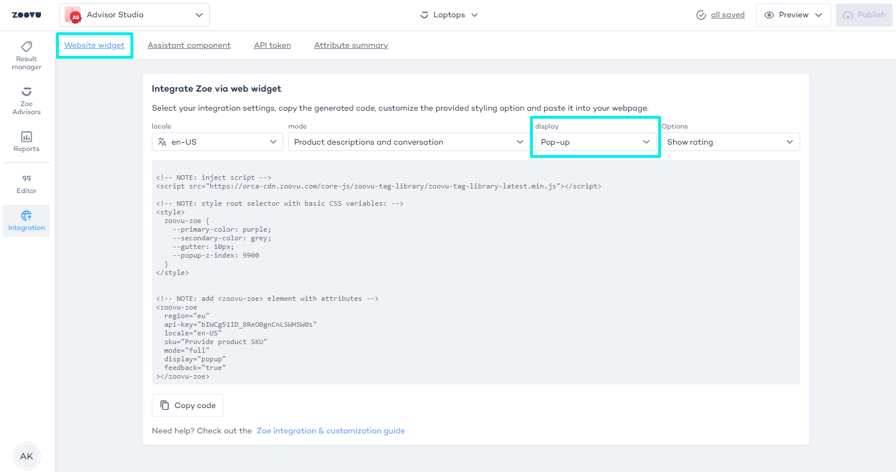
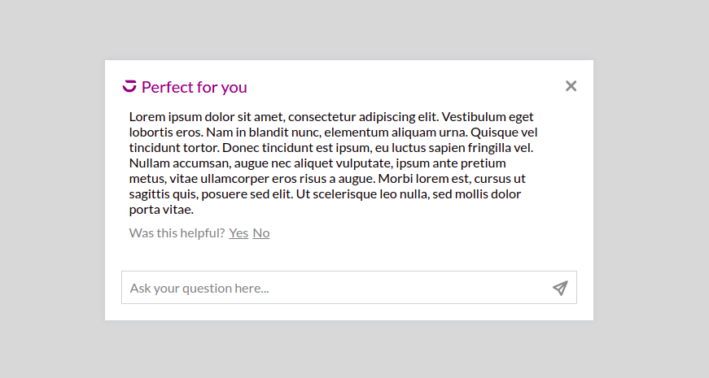

import BrowserWindow from "@site/src/components/BrowserWindow";

# Popup

You can add a button to your Product Detail Page that triggers a popup with Zoe when clicked. The popup can display a product description, a chat, or both description and chat.

## Popup integration

- Go to Advisor Studio > Zoe Advisors.
- Select and edit a Zoe Advisor.
- Navigate to **Advisor Studio > Zoe Advisors > Integration**.
- Select "Website widget".
- Set "display" to "Pop-up":

<BrowserWindow url="https://orca-advisor.zoovu.com">



</BrowserWindow>

The default popup code renders an "Ask about this product" button, which triggers a centered dialog with a backdrop.

See the 3 examples below for more ideas on how to style the popup on your page.


**Example 1**: Render a fixed button that triggers a right-bottom fixed dialog without a backdrop:

<BrowserWindow url="https://orca-advisor.zoovu.com">



</BrowserWindow>

```css
zoovu-zoe { 
  position: fixed; 
  right: 1em; 
  bottom: 1em; 
  width: auto; 
}

zoovu-zoe::part(popup) { 
  position: fixed; 
  margin: auto 1em 1em auto; 
  transform-origin: 0 100%; 
}

zoovu-zoe::part(popup-backdrop) { 
  display: none; 
  }

```

**Example 2**: Render a sticky button that triggers a relative dialog without a backdrop:

```css
zoovu-zoe { 
  position: sticky; 
  bottom: 1em; 
}

zoovu-zoe::part(popup) { 
  bottom: auto; 
}

zoovu-zoe::part(popup-backdrop) { 
  display: none; 
}

```

**Example 3**: Toggle dialog by event.

To add a custom button, hide your default button using CSS. 
Toggle the dialog using these events: `show-zoovu-zoe` or `hide-zoovu-zoe`.

```css
<style> 
zoovu-zoe::part(popup-button) { 
  display: none; 
} 
</style>

<script> 
function showZoe() { 
  document.querySelector('zoovu-zoe').dispatchEvent(new Event('show-zoovu-zoe')); 
} 
</script>

<button onclick="showZoe()">Show zoe</button>

```

## Templates

### Feedback acknowledgement

You can add the feedback acknowledgement option using an HTML template:

```html
<template id="zoe-attribute-feedback-acknowledgement">Feedback acknowledgement</template>
```