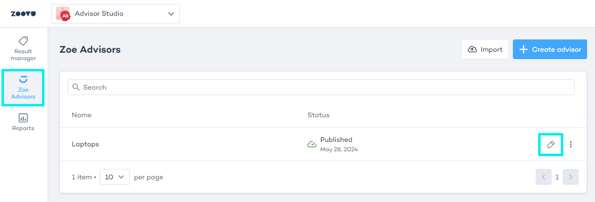
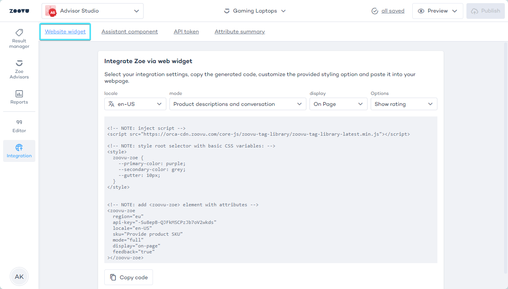

import BrowserWindow from "@site/src/components/BrowserWindow";

# Integrate Zoe using a website widget

Zoe can be implemented for generating product descriptions using a custom element called `<zoovu-zoe>`.

- Go to Advisor Studio > Zoe Advisors.
- Select and edit a Zoe Advisor:



- Navigate to **Advisor Studio > Zoe Advisors > Integration**.
- Select "Website widget":




## Embedding

### HTML

Use `<script id="zoovu-zoe-config" type="application/json">` to embed configuration settings as a JSON object or place them within appropriate custom element attributes.

```html
<script src="https://orca-cdn.zoovu.com/core-js/zoovu-tag-library/zoovu-tag-library-latest.min.js"></script>

<!-- via configuration script -->
<script id="zoovu-zoe-config" type="application/json">
{
    "region": "eu",
    "apiKey": "zoe-api-key",
    "locale": "en-IE",
    "sku": "sku"
}
</script>

<zoovu-zoe></zoovu-zoe>

<!-- or via attributes -->
<zoovu-zoe region="eu" api-key="zoe-api-key" locale="en-IE" sku="sku"></zoovu-zoe>

```

### JavaScript

```js
const script = document.createElement("script");
script.setAttribute('src',"https://orca-cdn.zoovu.com/core-js/zoovu-tag-library/zoovu-tag-library-latest.min.js"); 
document.head.appendChild(script); 
const zoe = document.createElement('zoovu-zoe'); 
zoe.setAttribute("region", "eu"); 
zoe.setAttribute("api-key", "zoe-api-key"); 
zoe.setAttribute("locale", "en-US"); 
zoe.setAttribute("sku", "sku"); 
document.body.appendChild(zoe);

```

## Configuration

| Property | Description | Required |
|--- |--- |--- |
| region | Where Zoe is deployed: `eu` (orca) or `us` (barracuda) | Yes |
| apiKey | Zoe API key | Yes |
| locale | Example: "en-US" | Yes |
| sku | Data Platform product identifier | Yes |
| context | Key-value pairs determining user preferences that correlate with Zoe configuration. | No |
| feedback | Show feedback options (like or dislike) to the user (`true` or `false`). | No (default: `true`) |
| mode | Main Zoe features: <ul><li>`full` (description and conversation)</li><li>`conversation` (conversation only)</li><li>`description` (description only)</li></ul> | No (default: `full`) |
| display | Main Zoe presentation features: <ul><li>`on-page`</li><li>`popup`</li></ul> | No (default: `on-page`) |
| animation | Add typing animation to Zoe responses and a default `popup` button (`true` or `false`). | No (default: `false`) |
| standardTexts | Allows you to override default texts used in ``<zoovu-zoe>`` | No (see the default standard texts below) |
| skuSelector | If you can't provide the `sku`, it can be taken from an element with a given selector. | No |
| skuAttribute | If you can't provide the `sku`, it can be taken from an attribute. | No |


#### Default standard texts

```json
{
"title": "Perfect for you",
"generalError": "We're experiencing a glitch. Please retry later.",
"chatGeneralError": "We're experiencing a glitch. Please retry later.",
"chatLimitError": "You reached your limit. Please restart to test again",
"chatUserMessageLimitError": "Question exceeds character limit",
"chatInputPlaceholder": "Ask your question here...",
"feedbackPrompt": "Was this helpful?",
"feedbackPositiveText": "Yes",
"feedbackNegativeText": "No",
"popupButton": "Ask about this product"
}

```


## Retrieve the SKU from a Product Detail Page

If you're unable to provide the products SKU (identifier) necessary for the Zoe Advisor configuration, here's how it can be retrieved:

- Using skuSelector: Specify a CSS selector to target an element's content. For instance, setting skuSelector: ".sku" retrieves the SKU from <div class="sku">123</div>, assuming the div exists in the DOM prior to zoovu-zoe.
- Using skuAttribute: Define an attribute to extract the SKU. With skuAttribute: "data-sku", the SKU is sourced from the data-sku attribute of <div data-sku="123">Something else</div>, provided the div is present in the DOM before zoovu-zoe.
- SKUs can also be acquired from existing structured or linked data within the DOM.


## Add custom CSS styling

All Zoe Advisor components will be styled by the global CSS with some basic CSS variables or specific parts can be styled using [shadow parts](https://developer.mozilla.org/en-US/docs/Web/CSS/::part).

```js
zoovu-zoe { 
  --primary-color: purple; 
  --secondary-color: grey; 
  --gutter: 1em;

  --popup-z-index: 9900 /* only "popup" display */ 
}

zoovu-zoe::part(title) {} /* only "full"/"description" mode */
zoovu-zoe::part(description) {} /* only "description" mode */
zoovu-zoe::part(conversation) {} /* only "full"/"conversation" mode */
zoovu-zoe::part(zoe-message) {} /* only "full"/"conversation" mode */
zoovu-zoe::part(user-message) {} /* only "full"/"conversation" mode */
zoovu-zoe::part(input) {} /* only "full"/"conversation" mode */
zoovu-zoe::part(submit) {} /* only "full"/"conversation" mode */
zoovu-zoe::part(feedback) {} /* only when feedback is set to "true" */
zoovu-zoe::part(popup) {} /* only "popup" display */
zoovu-zoe::part(popup-backdrop) {} /* only "popup" display */
zoovu-zoe::part(popup-button) {} /* only "popup" display */
const script = document.createElement("script");

script.setAttribute('src', "https://orca-cdn.zoovu.com/core-js/zoovu-tag-library/zoovu-tag-library-latest.min.js");

document.head.appendChild(script);

const style = document.createElement("style"); 
const css = ` 
zoovu-zoe { 
  --primary-color: white; 
  --secondary-color: lightcoral; 
  --custom-color: purple; 
  background: linear-gradient(90deg, var(--custom-color) 0%, var(--secondary-color) 100%); 
  box-shadow: rgb(206 47 215 / 76%) 0px 0px 10px; 
  color: var(--primary-color); 
  border-radius: 4px; 
  max-height: 215px;
}
zoovu-zoe::part(input), 
zoovu-zoe::part(input):hover, 
zoovu-zoe::part(submit) { color: var(--custom-color); }`;

style.appendChild(document.createTextNode(css));

document.head.appendChild(style);

const zoe = document.createElement('zoovu-zoe');
zoe.setAttribute('region', "eu"); 
zoe.setAttribute('api-key', "zoe-api-key"); 
zoe.setAttribute('locale', "en-US"); 
zoe.setAttribute('sku', "sku");

document.body.appendChild(zoe);

```