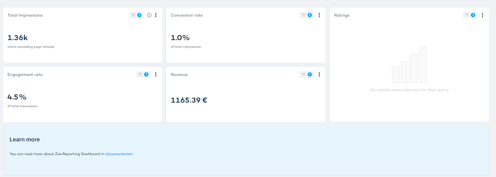
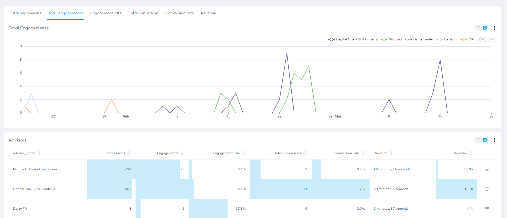
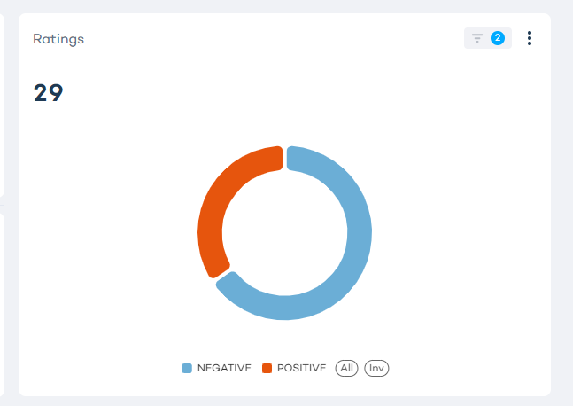
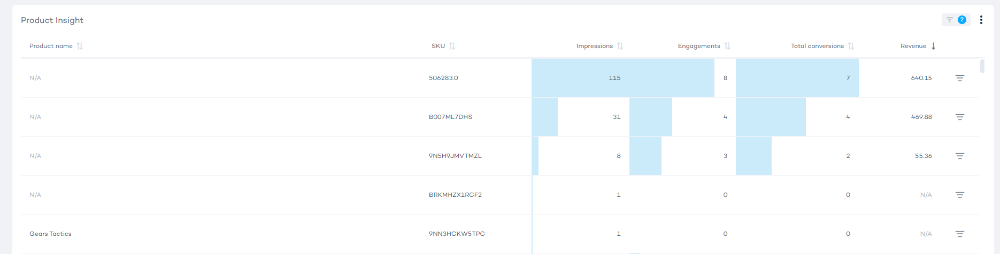
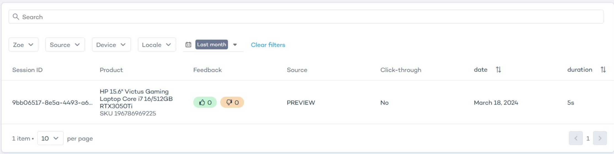

import BrowserWindow from "@site/src/components/BrowserWindow";

# Zoe reporting

Zoe Reporting provides a variety of metrics designed to give you a clearer understanding of customer engagement and the success of your Zoe setups. This guide will help you efficiently utilize the different sections of Zoe Reporting to gather actionable insights.

- [Available Metrics](#available-metrics)
- [Reporting Filters](#reporting-filters)
- [Basic Metric Cards](#basic-metric-cards)
- [Traffic & Engagement Table](#traffic--engagement-table)
- [Feedback Graph](#feedback-graph)
- [Product Insights Table](#product-insights-table)
- [Chat History](#chat-history)

## Available metrics

The metrics you can view in your reports vary depending on the type of integration (Assistant or Product Detail Page integration) and whether you enable tracking.

:::note

If tracking is enabled for both integration types - Digital Assistant and Product Detail Page - each integration will independently track and report metrics such as Conversions, Conversion Rate, and Generated Revenue.

:::

| Source    | Tracking | Metrics                                                                                     |
|-----------|----------|---------------------------------------------------------------------------------------------|
| Assistant | On       | Conversions, Conversion Rate, Generated Revenue, Click-throughs, CTR, Referred Revenue      |
| Assistant | Off      | Click-throughs, CTR, Referred Revenue                                                       |
| PDP       | On       | Conversions, Conversion Rate, Generated Revenue                                             |
| PDP       | Off      |                                                           |

## Reporting Filters

Use reporting filters to narrow down your analytics view based on specific parameters such as the Zoe advisor, integration type, date range, device, and region.

## Basic Metric Cards

This section displays key metrics like Impressions, Engagement Rate, Conversion Rate, Click-through Rate (CTR), Referred Revenue, and Generated Revenue. These metrics can help you assess the immediate impact of your content, understand how effectively your Zoe Assistants engage users, and measure the revenue.

<BrowserWindow url="https://orca-advisor.zoovu.com">
    
</BrowserWindow>

:::info

**Engagements** are defined as total number of times users interacted with Zoe Advisor.

**Visits** are defined as the number of distinct users that visited a domain URL and all its extensions for a time period. A visit from www.xyz.com/extension and from www.xyz.com/someother_extension are counted as two visits. Inactivity over 2 hours will create a new visit.

:::

## Traffic & Engagement Table

The Traffic & Engagement Table helps you visualize trends, assess the effectiveness of specific campaigns, and understand fluctuations in user engagement and purchasing behavior.

<BrowserWindow url="https://orca-advisor.zoovu.com">
    
</BrowserWindow>

## Feedback Graph

Feedback Graph shows the ratio of positive to negative feedback (thumbs up vs thumbs down) given by the customers.

<BrowserWindow url="https://orca-advisor.zoovu.com">
    
</BrowserWindow>

## Product Insights Table

The Product Insights Table displays detailed analytics on a per-product basis, including metrics like total referred and generated revenue, ranking of products by revenue contribution. 

This section is particularly useful for identifying high-performing products and optimizing your marketing strategies.

<BrowserWindow url="https://orca-advisor.zoovu.com">
    
</BrowserWindow>

## Chat History

Chat History logs detailed interactions within Zoe Advisor sessions, showing you what products were discussed, the feedback given, and how long users engaged.

<BrowserWindow url="https://orca-advisor.zoovu.com">
    
</BrowserWindow>