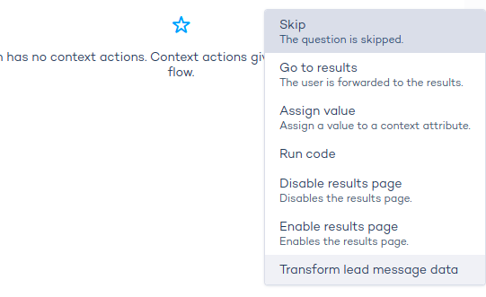

# Lead generation

:::info

Leadgen API v2 is available!

[Read more](#leadgen-without-server-sessions)

:::

## Webhooks

### Configuration

To set up a leadgen form using webhooks, select `webhook` in the dropdown and add the `Webhook URL`.


### Payload structure

The Zoovu platform will POST a message to the `Webhook URL` configured in the leadgen form. The body of the message contains:

- the name of the assistant
- the submitted form data, each form field has an identifier (*questionId*), the question (*questionText*) and the answer(s) (*answers*), modelled as a list.
- the questions flow, a list of questions using the same object structure as above
- the recommended products, with an indication if the product meets all the customer's needs (*perfect*) or only partly (*alternative*)

```json
{
  "advisorName": "documentation-assistant",
  "submittedFormData": [
    {
      "questionId": 3167166,
      "questionText": "name",
      "answers": ["Tech Writer"]
    },
    {
      "questionId": 3167167,
      "questionText": "email",
      "answers": ["techwriter@zoovu.com"]
    }
  ],
  "questionsFlow": [
    {
      "questionId": 3167168,
      "questionText": "What's your preferred brand?",
      "answers": ["Samsung"]
    }
  ],
  "recommendations": [
    {
      "sku": "880609E12",
      "name": "Samsung Galaxy Book S 13.3-inch Qualcomm 8cx/8GB/256GB SSD Laptop with 4G - Mercury Grey",
      "price": 1699,
      "match": "perfect"
    },
    {
      "sku": "88060912",
      "name": "Samsung Galaxy Book S 13.3-inch Qualcomm 8cx/8GB/256GB SSD Laptop with 4G - Earthy Gold",
      "price": 1699,
      "match": "perfect"
    },
    {
      "sku": "4,71802E+12",
      "name": "Asus 14-inch Celeron Dual Core/4GB/64GB eMMC Laptop - Pearl White",
      "price": 399,
      "match": "alternative"
    },
    {
      "sku": "9,42103E+12",
      "name": "Ollee 14.1-inch Celeron-N3350/4GB/64GB eMMC Laptop",
      "price": 399,
      "match": "alternative"
    }
  ]
}

```

### Leadgen without server sessions

Thanks to leadgen API v2 there's no longer a need to store questionnaire data in server sessions.

To start using the new API, simply disable the toggle in the assistant settings as shown below:


Leadgen legacy API relied on direct retrieval of questionnaire data from the session, while leadgen API v2 retrieve data directly from the browser, eliminating the necessity for enabling session storage by default.

An essential benefit of that is the elimination of keeping potential PII data in a session, leading to enhanced security, and a noticeable performance boost.

Moreover we allow for leadgen data transformation. To find out more read section below.

### Transformation hook

The transformation of lead generation data is accessible through the new Leadgen API v2.

To use this functionality, establish a new context action named **Transform lead message data** within the lead generation question:



**Transform lead message data** action is triggered on the submission of a lead message.


This action allows for JavaScript execution, granting access to both the `leadMessageData` and `contextSdk` objects. The code requires `return` statement with origin structure of `leadMessageData` that contains:

- `submittedFormData`
- `questionsFlow`
- `recommendations`

These elements share identical models as those in the payload. However, it's important to note that `submittedFormData` and `questionsFlow` contain an extra property, namely **questionType**. While this property is not transmitted in the payload, its inclusion can be valuable for the logic of transformation.


```js
 {
  "submittedFormData": [
    {
      "questionId": 2,
      "questionText": "email",
      "answers": ["name@zoovu.com"],
      "questionType": "EMAIL",
    }
  ],
  "questionsFlow": [
    {
      "questionId": 1,
      "questionText": "What is your favorite game?",
      "answers": ["Tomb raider"],
      "questionType": "TEXT",
    }
  ],
  "recommendations": [
     {
      "sku": "12345",
      "name": "Tomb Raider Game of the Year Edition",
      "price": 1699,
      "match": "perfect"
    },
  ]
}
```


The structure of `leadMessageData` remains consistent across all recipient system types. However, it's important to note that any extensions (new custom properties) added to `leadMessageData` will only take effect for the *webhook* type.

examples:

```js
// skipping questionsFlow and recommendations
return {
  submittedFormData: leadMessageData.submittedFormData,
  questionsFlow: [],
  recommendations: []
}
```

```js
// adding custom property works only for webhook type
return {
  ...leadMessageData,
  additionalProperty: "Something to add"
}
```
